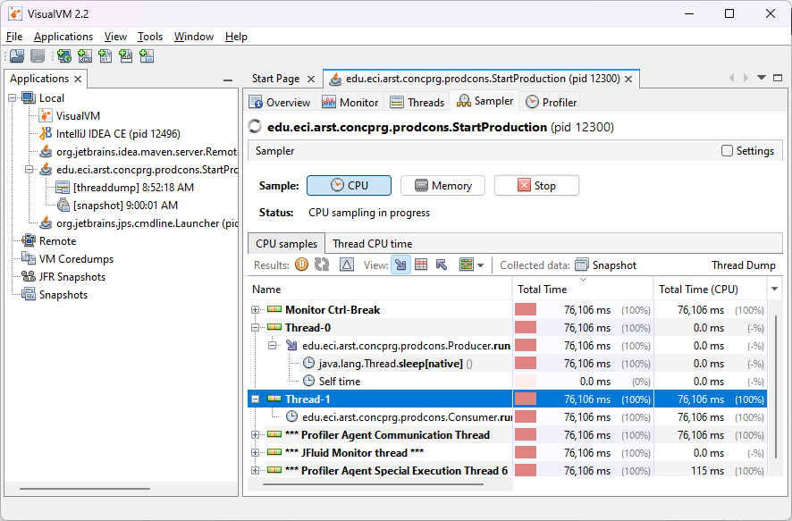
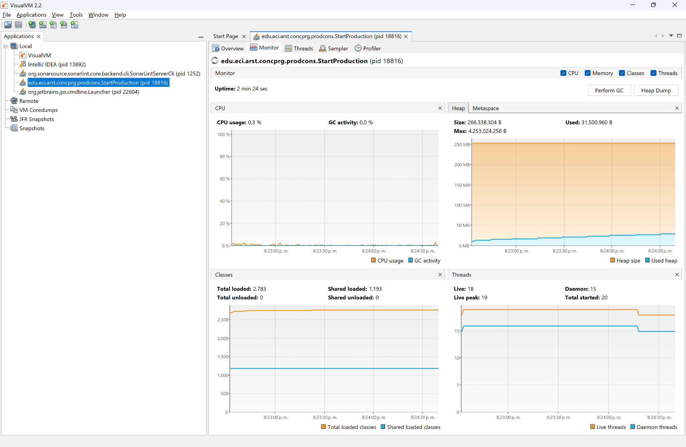

# 🧵 Laboratorio 3 - Programación concurrente, condiciones de carrera y sincronización de hilos.

**Escuela Colombiana de Ingeniería Julio Garavito**  
**Curso:** Arquitectura de Software (ARSW)

---

## 👥 Integrantes del grupo

- Vicente Garzón Ríos
- Daniel Alejandro Díaz Camelo

---

## 📌 Descripción

Este laboratorio aborda conceptos de **programación concurrente** en Java, enfocándose en la sincronización de hilos, el manejo del problema **productor–consumidor**, y la prevención de **deadlocks** mediante mecanismos de coordinación y suspensión segura.


---

## 📂 Parte I - Control de hilos con wait/notify. Productor/consumidor.

## 1. Análisis de Consumo de CPU con VisualVM

Al ejecutar el programa y analizarlo con **VisualVM**, se observa el comportamiento de los hilos que forman parte del sistema productor-consumidor:

### 📊 Consumo general de CPU

- El programa presentó un consumo promedio de **~13% de CPU** durante la ejecución.
- Este uso corresponde casi en su totalidad al **hilo consumidor**, ya que el productor pasa la mayor parte del tiempo dormido.

📷 _Evidencia (VisualVM)_

<p align="center">
  
</p>

### 🧵 Hilos en ejecución

- `Thread-0`: ejecuta `edu.eci.arst.concprg.prodcons.Producer.run()`
- `Thread-1`: ejecuta `edu.eci.arst.concprg.prodcons.Consumer.run()`

📷 _Evidencia (VisualVM)_

<p align="center">
  
</p>

### 🔍 Análisis del Productor (`Thread-0`)

El hilo está en estado de espera, específicamente en la llamada:
  ```java
  java.lang.Thread.sleep(native)
  ```

Esto indica que el productor se encuentra dormido, por lo tanto:
- No realiza trabajo activo.
- Su `Total Time (CPU)` es de **0 ms**, lo que confirma que **no esta consumiendo CPU**.

### 🔍 Análisis del Consumidor (`Thread-1`)

El consumidor está ejecutando el metodo:
  ```java
  edu.eci.arst.concprg.prodcons.Consumer.run()
  ```

Se observa lo siguiente:
- `Total time`: 76,106 ms.
- `Total time (CPU)`: 76,106 ms.

Esto implica que el hilo ha estado activo **todo el tiempo muestreado**, y que **ha utilizado la CPU continuamente.**

### ✅ Conclusión

- El consumo total de CPU fue de **13%**, atribuible casi por completo al hilo **`Consumer`**.
- El alto consumo de CPU se debe al **`Consumer`**, que permanece en un bucle infinito verificando si la cola tiene elementos disponibles.
- Esta forma de ejecución produce un comportamiento de **busy waiting**, en el cual el hilo se mantiene activo aunque no tenga trabajo que realizar.
- La clase responsable del consumo de CPU es: **`edu.eci.arst.concprg.prodcons.Consumer`**.
- El problema radica en la ausencia de mecanismos de sincronización (`wait()` y `notify()`), que permitirían que el consumidor quedara bloqueado hasta que existieran elementos que procesar.

## 2. Ajuste con `wait()` y `notify()`

Se realizaron ajustes en la cola compartida (`Queue`) incorporando los métodos **wait()** y **notifyAll()** para mejorar la eficiencia en el uso de CPU.

Con esta modificación, cuando el consumidor intenta obtener un elemento y la cola está vacía:
- El hilo entra en estado de **espera bloqueante (`WAITING`)** mediante `wait()`.
- Se elimina el ciclo de consulta continua, evitando el **busy waiting**.

Cuando el productor inserta un nuevo elemento en la cola, se llama a `notifyAll()`, lo que **despierta al consumidor** para que procese el dato.

### 📊 Consumo general de CPU

- El consumo promedio de CPU se redujo drásticamente en comparación con el punto 1, pasando de ~13% a **~0,3%**.
- El consumidor ya **no mantiene ocupado el procesador** innecesariamente: solo se activa cuando hay datos para consumir.
- Esto confirma que la solución ahora aprovecha la CPU de manera **más eficiente**.

📷 _Evidencia (VisualVM)_

<p align="center">
  
</p>

### 🧵 Hilos en ejecución

- `Thread-0`: ejecuta `edu.eci.arst.concprg.prodcons.Producer.run()`
- `Thread-1`: ejecuta `edu.eci.arst.concprg.prodcons.Consumer.run()`

📷 _Evidencia (VisualVM)_

<p align="center">
  
</p>

### 🔍 Análisis del Productor (`Thread-0`)

El productor mantiene su comportamiento original:
- Genera un nuevo dato cada segundo (**`Thread.sleep(1000)`**).
- Su consumo de CPU es **prácticamente nulo** ya que pasa la mayor parte del tiempo dormido.

### 🔍 Análisis del Consumidor (`Thread-1`)

El consumidor está ejecutando los metodos:
```java
edu.eci.arst.concprg.prodcons.Queue.get()
java.lang.Object.wait()
```

Esto confirma que:
- El consumidor ya **no ejecuta un bucle activo** revisando la cola.
- Permanece en espera hasta recibir notificación del productor.
- Su consumo de CPU es **cercano a 0%** mientras está bloqueado.

### ✅ Conclusión

- El **busy waiting** fue eliminado por completo.
- La sincronización con **wait() y notifyAll()** asegura que los hilos solo consuman CPU cuando realmente hay trabajo que realizar.
- El consumo de CPU disminuyó de manera significativa (**~13% → ~0,3%**).
- El sistema ahora logra un **uso mucho más eficiente de los recursos**.